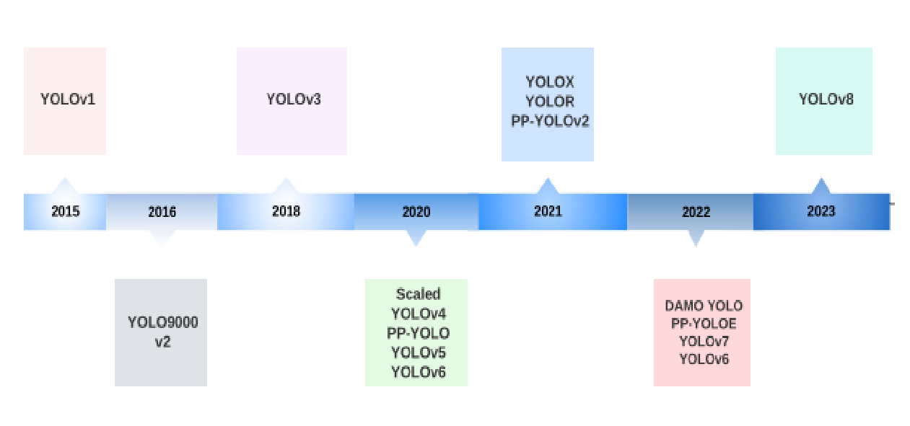

  

### Contents
---
- [YOLO: You Only Look Once](YOLOv1/README.md)  
- [YOLO9000: Better, Faster, Stronger](YOLOv2/README.md)  
- [YOLOv3: An Incremental Improvement](YOLOv3/README.md)  
- [YOLOv4: Optimal Speed and Accuracy of Object Detection](YOLOv4/README.md)  

### Description
---
yoloV1부터 yoloV4까지 직접 구현해보았습니다. 이미 웹에 pytorch로 구현한 코드들이 많이 존재했기 때문에, 최대한 활용은 하였으나, 코드들은 전부 제 이해를 바탕으로 직접 작성한 코드들입니다.

### Motivation
---
논문을 읽고 이해했다고 '생각'했던 것들을 직접 구현해보면서, 지식의 빈 부분들을 채울 수 있었습니다. 또한, 논문 버젼이 업그레이드됨에 따라 Object Detection 성능향상을 위해 학계에 어떤 시도들이 있었는지 흐름을 파악하고 구현할 줄 안다면, 다른 object detection 모델의 성능을 향상시켜야할 때 레퍼런스가 될 수 있겠다는 생각이 들었습니다.   

### Major Requirements
---
- pytorch
- pytorch_lightning
- albumentations
- hydra  

### Dataset
---
Berkeley DeepDrive Dataset  
- link : https://bdd-data.berkeley.edu/  
- pascal_voc 형태, [x1,y1,x2,y2]를 인풋으로 받습니다. yolo format은 [x_center, y_center, w, h]이지만, image augmentation을 위해 사용한 albumentations 라이브러리에서 yolo format을 처리할 시에 생기는 에러를 처리하기 위해 pascal_voc로 인풋을 받고, 데이터로더에서 yolo format으로 변환합니다.
- 데이터 형식은 [objectness, x, y, w, h, classes]입니다. 버젼에 따라 조금씩의 차이는 존재합니다.
- 데이터 처리부분은 `dataprocessing.ipynb`를 참고하시면 됩니다. 

