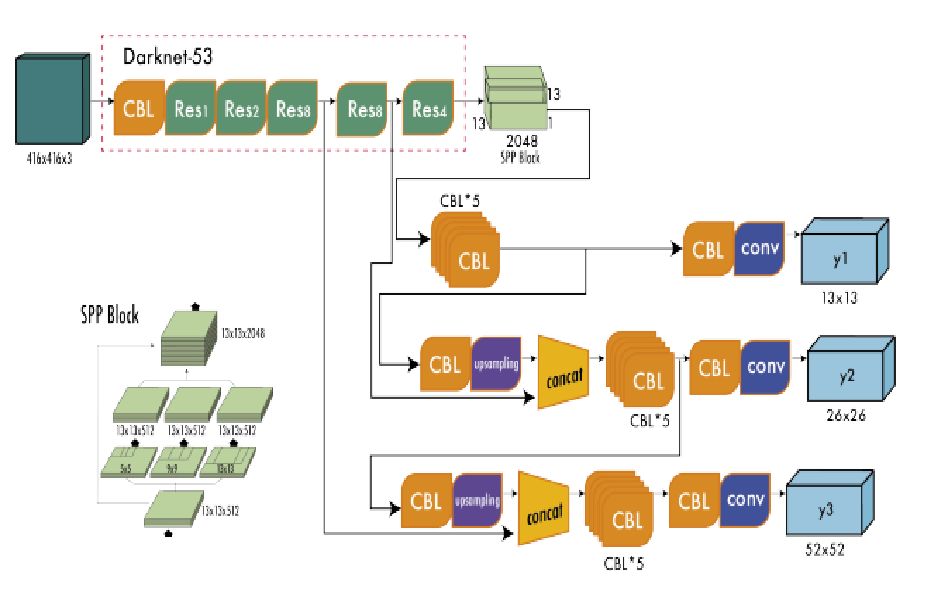

## YOLOv3: An Incremental Improvement
[blog post](https://silvercity.oopy.io/a0af8c08-1165-4e59-84ee-ed5b0a6bd0f7)
### model architecture
 

#### new features
- class prediction, use binary cross-entropy. multi-label
- predicts boxes at 3 different scales, 3boxes at each scale
    - feature map from 2 layers previous and upsample it by 2x
- DarkNet-53
